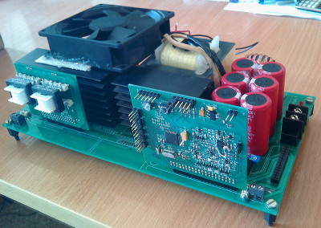

# UniSP-hardware
(..sketch..)

## About UniSP

UniSP is an open source project that aims to develop universal high power SMPS (Swiched-mode power supply) platform.

Main features:
- based on full bridge DC/DC converter
- digital controll based on STM32F334 microcontroller
- modular desing
- communication interface
- output module interface

Source code and doc for software part of project can be find on <https://github.com/UniSP/UniSP-software>

## About UniSP-hardware

UniSP-hardware is dividing into the following modules:
- **UniSP-mainboard** - main power section including primary and secondary side of converter.
- **UniSP-pfc-LT1249** - active power factor correction based on Linear LT1249.
- **UniSP-pfc-bl** - (planned) bridgeless PFC with low power supply on board.
- **UniSP-driver** - main control unit with STM32F334R8 uC on board
- **UniSP-bridge_driver** - full bridge transistors driver.
- **UniSP-bridge_driver_PSFB** - (planned) full bridge transistors driver supporting phase shifted resonant PWM controll technique.
- **UniSP-rectifier_driver** - (planned) synchronous rectifier transistors driver (GDT?).
- Optionally output module (**UniSP-out_module**) controled by UniSP output interface.

Each module (except UniSP output modules) is placed in individual subfolder in UniSP-hardware repository. 

UniSP output modules (hardware and software) will be places in a separated repositories.

UniSP output interface consists of:
- 2 current sense input (fast speed and normal speed)
- 2 voltage sense input (fast speed and normal speed)
- 2 high-resolution timer outputs (TIMERD and TIMERE - each with 2 channel)
- 15V supply output
  
### Details

| Module                  | Circuit diagram                                      | PCB status   | Next action         |
|-------------------------|------------------------------------------------------|--------------|---------------------|
| UniSP-mainboard         | [Link](doc/scheme/UniSP-mainboard.pdf)               | In progress  |                     |
| UniSP-pfc-LT1249        | [Link](doc/scheme/UniSP-pfc-LT1249.pdf)              | In progress  | Add aux PS section  |
| UniSP-pfc-bl            | In progress                                          | ----         |                     |
| UniSP-driver            | [Link](doc/scheme/UniSP-driver.pdf)                  | In progress  |                     |
| UniSP-bridge_driver     | [Link](doc/scheme/UniSP-bridge_driver.pdf)           | Done         |                     |
| UniSP-bridge_driver_PSFB| [Link](doc/scheme/UniSP-bridge_driver_PSFB.pdf)      | In progress  |                     |
| UniSP-rectifier_driver  | In progress                                          | ----         |                     |

Please visit the author's website ~~www.railab.me~~ (under construction) for worklogs, articles and other interesting content ;]

### TODO
- finish new mainboard PCB
- add 3D models
- add modules to official KiCad library
- 3D model (in FreeCAD)
- chassis
- EMI/RFI shielding ?
- improve EMC

### UniSP-hardware roadmap
- documentation
- costs optimisation
- user interface
- synchronous rectification on secondary side
- soft swiching on primary side (phase shifted full bridge)
- bridgeless PFC
